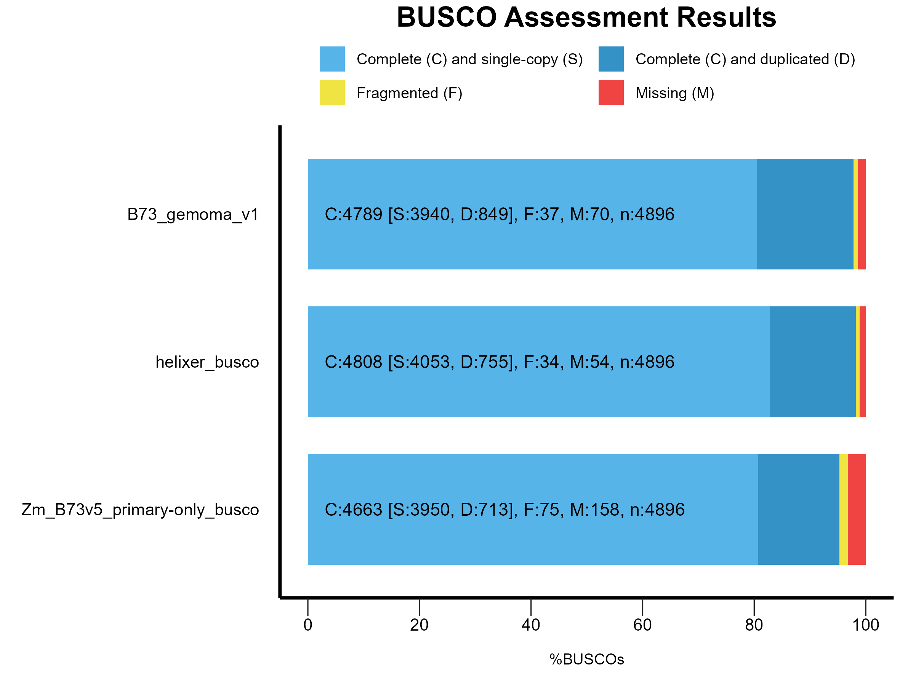
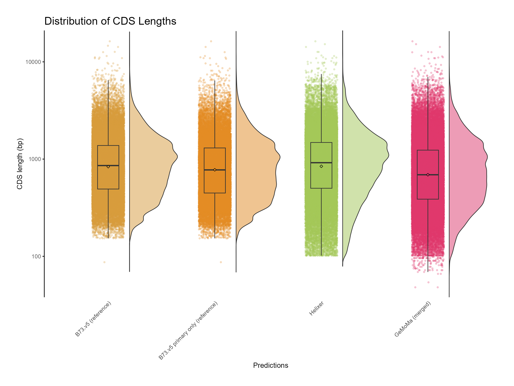
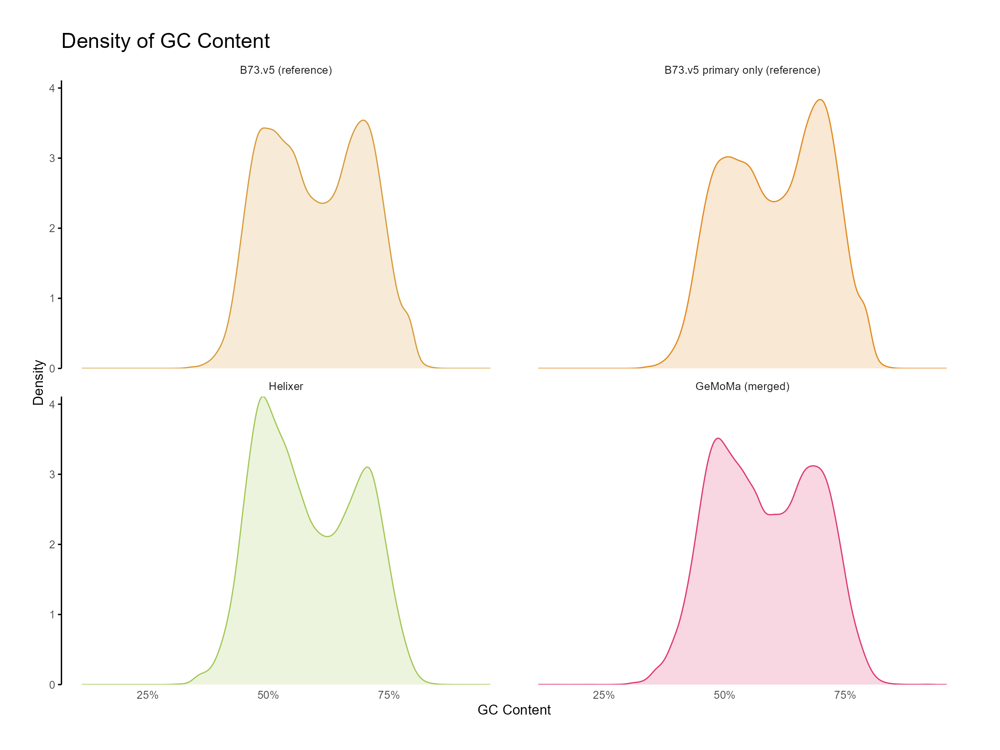
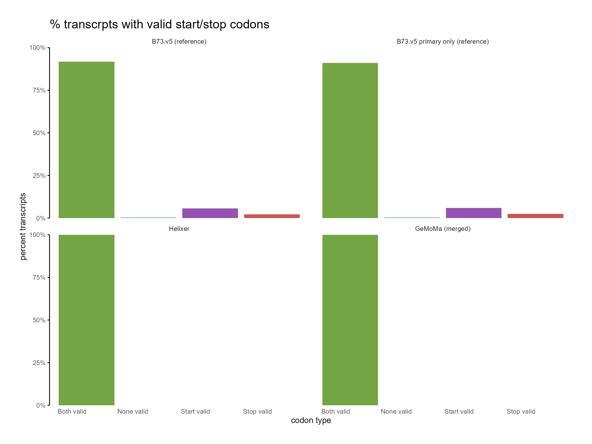

# GeMoMa to merge annotations


## 📝 **Prerequisites**

:::{card}
**📁 Input files**
^^^
- Target genome assembly (`fasta` format) - we will use B73.v5 genome
- _ab initio_ predictions (`.gff3` format) - we will use Helixer output
- Homology predictions (`.gff3` format) - Sorghum and B97 annotations 

:::

:::{card}
**💻 Software**
^^^
- GeMoMa (version ≥ 1.9 recommended)
- Dependencies: `java >1.8`, `blast` or `mmseqs`
:::


## 🧬 GeMoMa overview

[Gene Model Mapper (GeMoMa)](https://www.jstacs.de/index.php/GeMoMa) is a homology-based gene prediction tool that transfers protein-coding gene models from one or more reference genomes to a target genome. It can incorporate RNA-seq evidence, filter predictions using customizable criteria, and merge multiple annotations—including ab initio and transcriptome-based predictions—into a unified gene set.


## 🔍 Use case: merging annotations 

Helixer is a deep learning-based predictor that provides accurate gene predictions from genome sequence alone. However, it does not predict alternative isoforms and tends to **collapse all transcript variants into a single flattened gene model**, especially in regions with overlapping exons or alternative splicing.

Homology predictions can be used to recover these missing isoforms and provide additional context for gene structure. **GeMoMa excels at this task** by leveraging evolutionary conservation across related species, allowing it to transfer annotations from well-annotated genomes to the target genome.

By merging Helixer predictions with GeMoMa:

* 🧠 You retain **Helixer's high confidence gene boundaries** and structure for primary transcripts.
* 🔁 You recover **missing isoforms** and splice variants that Helixer collapses.
* 🔍 You gain **orthology-supported annotation refinement** using multiple maize lines and related species like *Sorghum bicolor*.
* 🧬 You generate a **more complete and biologically realistic gene set**, even without long-read or isoform-resolving RNA-seq data.

This hybrid strategy takes advantage of both **machine learning accuracy** and **evolutionary conservation** to compensate for the limitations of any single method.


## 🗂️ Input preparation

In this example, for the B73.v5 genome, we will merge _ab initio_ predictions obtained from Helixer with the homology predictions of its close relatives (Maize inbred B97 and Sorghum).

1. Download target genome:

```bash
wget https://download.maizegdb.org/Zm-B73-REFERENCE-NAM-5.0/Zm-B73-REFERENCE-NAM-5.0.fa.gz
```

2. Download Helixer predictions:

```bash
wget
```

3. Download homology predictions (genome and gff3 files):

```bash
wget https://download.maizegdb.org/Zm-B97-REFERENCE-NAM-1.0/Zm-B97-REFERENCE-NAM-1.0.fa.gz
wget https://download.maizegdb.org/Zm-B97-REFERENCE-NAM-1.0/Zm-B97-REFERENCE-NAM-1.0_Zm00018ab.1.gff3.gz
wget https://ftp.sorghumbase.org/release-9/fasta/sorghum_bicolor/dna/Sorghum_bicolor.Sorghum_bicolor_NCBIv3.dna.toplevel.fa.gz
wget https://ftp.sorghumbase.org/release-9/gff3/sorghum_bicolor/Sorghum_bicolor.Sorghum_bicolor_NCBIv3.gff3.gz
```

4. Unzip the downloaded files:

```bash
gunzip Zm-B73-REFERENCE-NAM-5.0.fa.gz
gunzip Zm-B97-REFERENCE-NAM-1.0_Zm00018ab.1.gff3.gz
gunzip Sorghum_bicolor.Sorghum_bicolor_NCBIv3.dna.toplevel.fa.gz
gunzip Sorghum_bicolor.Sorghum_bicolor_NCBIv3.gff3.gz
```


## 🚀 Setup GeMoMa

GeMoMa is executed using a Java-based CLI pipeline. Here we will run GeMoMa with the target genome, Helixer predictions, and homology-based annotations from related species. We will generate a merged annotation file in GFF3 format.

We will install GeMoMa using BioConda:

```bash
module --force purge
module load conda
conda create -n gemoma  # Press 'y' when prompted
conda activate gemoma
conda install -c bioconda gemoma

```
After installation, the GeMoMa JAR file is located under the environment’s shared directory. You can set the path like this:

```bash
gemoma_jar="${CONDA_ENVS_PATH}/share/gemoma-1.9-0/GeMoMa-1.9.jar"
```


## 🛠️ Run GeMoMa

```bash
#!/bin/bash
# activate conda environment
module --force purge
module load conda
conda activate gemoma
# Set GeMoMa JAR path
gemoma_jar="${CONDA_ENVS_PATH}/share/gemoma-1.9-0/GeMoMa-1.9.jar"

# Function to check file existence and resolve full path
check_file() {
    if [[ ! -f "$1" ]]; then
        echo "ERROR: File not found: $1" >&2
        exit 1
    fi
    realpath "$1"
}

# Check and assign input files
genome=$(check_file Zm-B73-REFERENCE-NAM-5.0.fa)
sorghumFa=$(check_file Sorghum_bicolor.Sorghum_bicolor_NCBIv3.dna.toplevel.fa)
sorghumGFF=$(check_file Sorghum_bicolor.Sorghum_bicolor_NCBIv3.gff3)
maize1=$(check_file Zm-B97-REFERENCE-NAM-1.0.fa)
maize1GFF3=$(check_file Zm-B97-REFERENCE-NAM-1.0_Zm00018ab.1.gff3)
helixer=$(check_file Zm-B73-HELIXER-NAM-1.0.gff3)

# Other config
name="B73_v5_GeMoMa" # Prefix for gene names
cpus=${SLURM_CPUS_ON_NODE:-8} # Default to 8 CPUs if not running on SLURM
TMPDIR=${TMPDIR:-/tmp} # Use system temp directory if not set
dir="gemoma_output" # Output directory

# Run GeMoMa
java -Xms100g -Xmx200g -Djava.io.tmpdir=$TMPDIR -jar ${gemoma_jar} CLI GeMoMaPipeline \
    t=$genome \
    s=own i=sb a=$sorghumGFF g=$sorghumFa \
    s=own i=zm a=$maize1GFF3 g=$maize1 \
    ID=helixer e=$helixer \
    AnnotationFinalizer.u=NO \
    AnnotationFinalizer.r=SIMPLE AnnotationFinalizer.p=$name \
    AnnotationFinalizer.n=true \
    sc=false o=false p=true pc=true pgr=false \
    threads=$cpus outdir=$dir &> ${dir}/gemoma.log
```

Save this script as `run_gemoma.sh` and run it in a terminal with the command:

```bash
chmod +x run_gemoma.sh
./run_gemoma.sh
```

The options used in the command above are:

| **Option**                     | **Explanation**                                                              |
| ------------------------------ | ---------------------------------------------------------------------------- |
| `t=$genome`                    | Target genome (FASTA) to annotate.                                           |
| `s=own`                        | Reference species data will be extracted by GeMoMa from annotation + genome. |
| `i=sb`                         | Identifier for reference species (*Sorghum bicolor*).                        |
| `a=$sorghumGFF`                | GFF3 gene annotation for *Sorghum bicolor*.                                  |
| `g=$sorghumFa`                 | FASTA genome for *Sorghum bicolor*.                                          |
| `i=zm`                         | Identifier for second reference species (e.g., maize B97).                   |
| `a=$maize1GFF3`                | GFF3 gene annotation for maize B97.                                          |
| `g=$maize1`                    | FASTA genome for maize B97.                                                  |
| `ID=helixer`                   | Unique label for Helixer-based annotation source.                            |
| `e=$helixer`                   | External GFF3 annotation to be merged (Helixer output).                      |
| `AnnotationFinalizer.u=`       | Disable UTR prediction (no RNA evidence available).                          |
| `AnnotationFinalizer.r=SIMPLE` | Rename gene/transcript IDs using a simple prefix-based system.               |
| `AnnotationFinalizer.p=$name`  | Prefix used in renaming genes and transcripts.                               |
| `AnnotationFinalizer.n=true`   | Add new names as `Name=` attributes in GFF3 output.                          |
| `sc=false`                     | Disable synteny check.                                                       |
| `o=false`                      | Do not write individual predictions per reference species.                   |
| `p=true`                       | Output predicted proteins as FASTA.                                          |
| `pc=true`                      | Output predicted CDSs as FASTA.                                              |
| `pgr=false`                    | Do not output predicted genomic regions.                                     |
| `threads=$cpus`                | Number of compute threads to use.                                            |
| `outdir=$dir`                  | Output directory for all GeMoMa results.                                     |


## 📈 Interpreting results

The GeMoMa output will be stored in the specified `gemoma_output` directory. The main results include:

- `final_annotation.gff` : Merged GFF3 annotation file containing gene models from Helixer and homology predictions.
- `predicted_proteins.fasta`: FASTA file with predicted protein sequences.
- `predicted_cds.fasta`: FASTA file with predicted coding sequences (CDS).


If you examine the log file (`gemoma.log`), you will see some important stats, including any warnings or errors encountered during the run. 

You can also check the number of genes and transcripts in the final annotation:

```bash
grep -v '^#' gemoma_output/final_annotation.gff | cut -f3 | sort | uniq -c
```
Which should give you the counts for all features.

```
 246097 CDS
  58847 gene
  60137 mRNA
```

You can clean up the `gff` file using the `genometools` utility:

```bash
ml --force purge
ml genometools
ml agat
gff3_file=gemoma_output/final_annotation.gff
gt gff3 \
   -sort \
   -tidy \
   -setsource "gemoma" \
   -force \
   -o B73-gemoma_gt.gff3 \
   $gff3_file
agat_convert_sp_gxf2gxf.pl \
    -g B73-gemoma_gt.gff3 \
    -o B73-gemoma_v1.0.gff3
gffread B73-gemoma_v1.0.gff3 \
    -g Zm-B73-REFERENCE-NAM-5.0.fa \
    -x B73-gemoma_v1.0.cds.fasta  \
    -y B73-gemoma_v1.0.pep.fasta
```

### 🔎 Quality assessment


#### A. BUSCO profiling

Run BUSCO to assess the completeness of the merged annotation:

```bash
ml --force purge
ml busco
busco \
    -i B73-gemoma_v1.0.pep.fasta \
    -c $SLURM_CPUS_ON_NODE \
    -o B73-gemoma_v1.0_busco \
    -m prot \
    -l poales_odb10
```

We can compare the results with the previously generated Helixer and B73.v5 annotations and whole genome assembly BUSCO results.




**Figure 1: BUSCO results for Helixer, B73.v5 (MaizeGDB) and merged (GeMoMa) annotations.**


#### B. Comparing annotations

Compare Helixer original predictions with GeMoMa:

```bash
conda activate mikado
mikado compare \
    --protein-coding \
    -r Zm-B73-HELIXER-NAM-1.0.gff3 \
    -p B73-gemoma_v1.0.gff3 \
    -o ref_NAM.B73v5-vs-prediction_HELIXERv1_compared \
    --log compare.log
```

Compare B73.v5 (MaizeGDB) predictions with GeMoMa:

```bash
mikado compare \
    --protein-coding \
    -r Zm-B73-REFERENCE-NAM-5.0_Zm00001eb.1.gff3 \
    -p B73-gemoma_v1.0.gff3 \
    -o ref_NAM.B73v5-vs-prediction_HELIXERv1_compared \
    --log compare.log
```


#### D. Functional annotation


The Eukaryotic Non-Model Transcriptome Annotation Pipeline (EnTAP) can be used for functional annotation of the predicted genes. 

```bash
ml purge
ml anaconda
conda activate entap
cds="B73-gemoma_v1.0.cds.fasta"
EnTAP \
    --runP \
    -i ${cds} \
    -d ${RCAC_SCRATCH}/entap_db/bin/ncbi_refseq_plants.dmnd \
    -d ${RCAC_SCRATCH}/entap_db/bin/uniprot_sprot.dmnd  \
    -t ${SLURM_CPUS_ON_NODE} \
    --ini ${RCAC_SCRATCH}/entap_db/entap_config.ini

```

#### E. Summary Statistics

You can summarize the results using the `agat` utility:

```bash
ml biocontainers
ml agat
agat_sp_statistics.pl \
    -g B73-gemoma_v1.0.gff3 \
    -o B73-gemoma_v1.0.stats
```

#### F. OMArk proteome assesment

OMArk can be used to assess the quality of the predicted proteome:

```bash
ml --force purge
ml seqtk
omark_sif="${RCAC_SCRATCH}/omark/omark_0.3.0--pyh7cba7a3_0.sif"
peptide="B73-gemoma_v1.0.pep.fasta"
database="${RCAC_SCRATCH}/omark/LUCA.h5"
grep ">" ${peptide} |\
    sed -e 's/gene=/\t/g' -e 's/>//g' |\
    sort -uk2,2 |\
    cut -f 1 > primary.ids
seqtk subseq ${peptide} primary.ids > ${peptide%.*}.primary.pep.fasta
apptainer exec ${omark_sif} omamer search \
    --db ${database} \
    --query ${peptide%.*}.primary.pep.fasta \
    --out ${peptide%.*}.omamer \
    --nthreads ${SLURM_CPUS_ON_NODE}
```


#### G. CDS assesments

```bash
cds="B73-gemoma_v1.0.cds.fasta"
bioawk -c fastx 'BEGIN{OFS="\t"}{
    print $name,length($seq),gc($seq),substr($seq,0,3),reverse(substr(reverse($seq),0,3))
    }' ${cds} > ${cds%.*}.info
```

The plots were generated using the following R script: [`cds_assesment.R`](assets/scripts/gemoma_cds_assesment.R)

::::{tab-set}

:::{tab-item} CDS length



Figure 8: Distribution of CDS length for GeMoMa, Helixer and NAM.v5 predictions. 

:::


:::{tab-item} GC content



Figure 9: Distribution of GC content for GeMoMa, Helixer and NAM.v5 predictions. 

:::


:::{tab-item} Codon type



Figure 10: Distribution of start and stop codons for GeMoMa, Helixer and NAM.v5 predictions.

:::

::::


### 🎊 Conclusions

