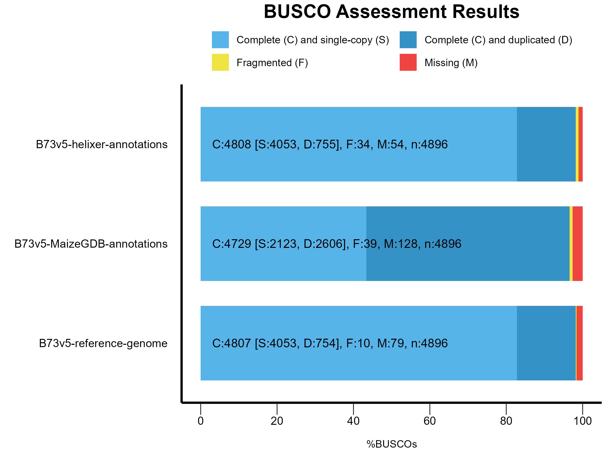
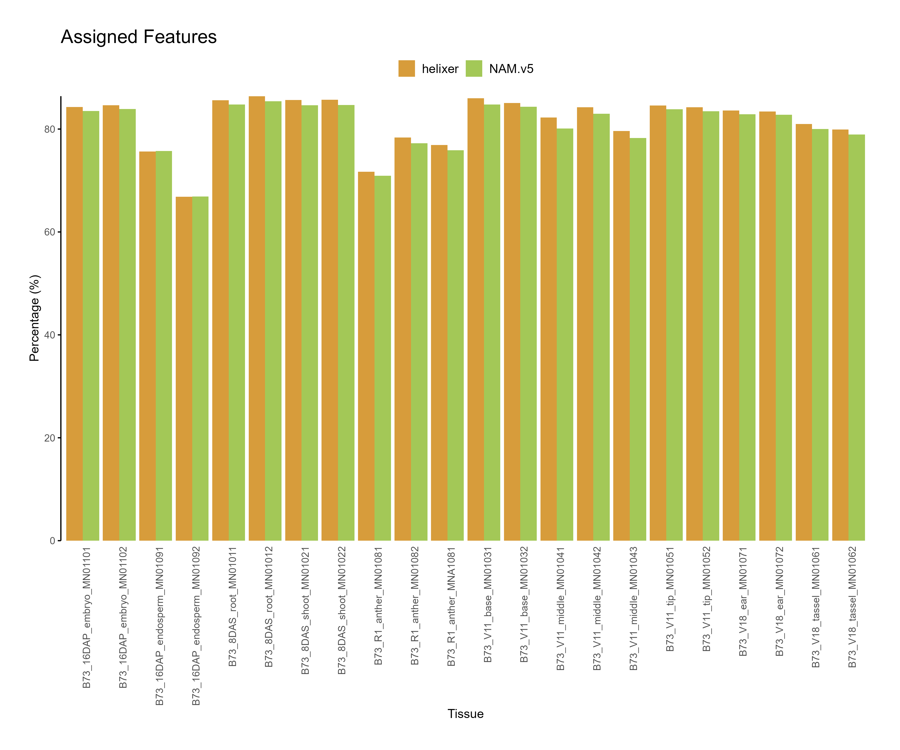
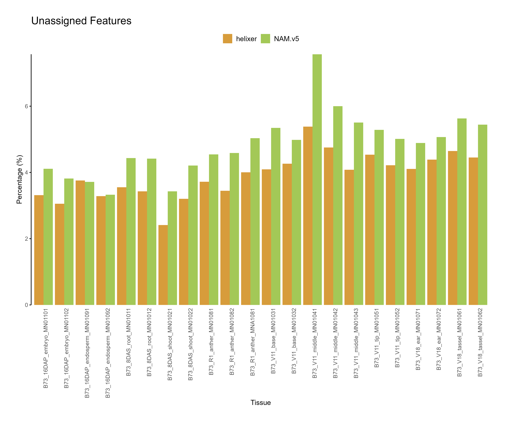
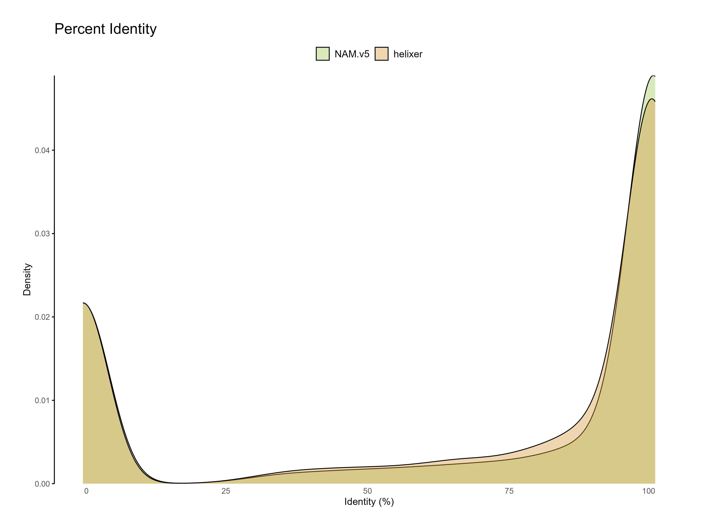
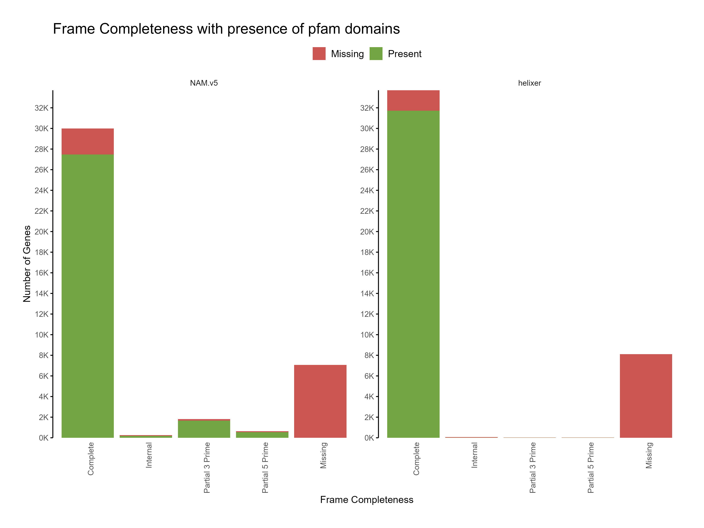
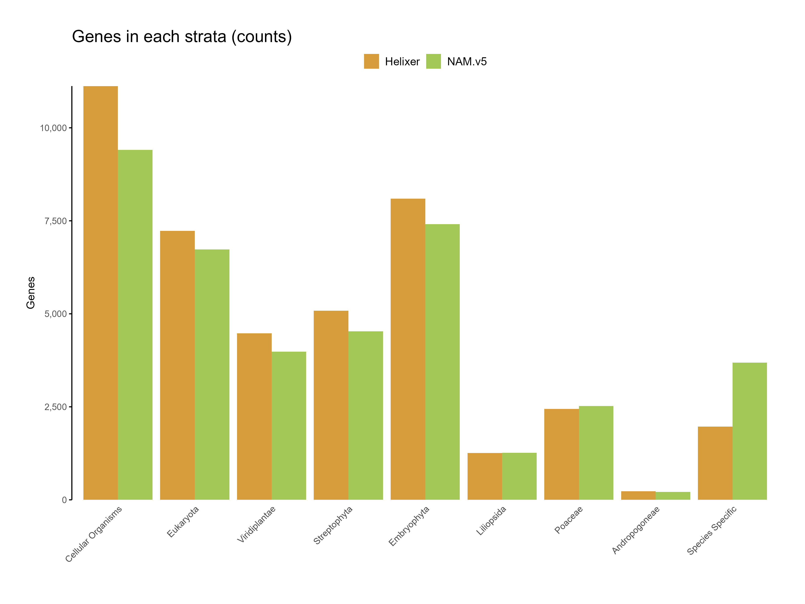
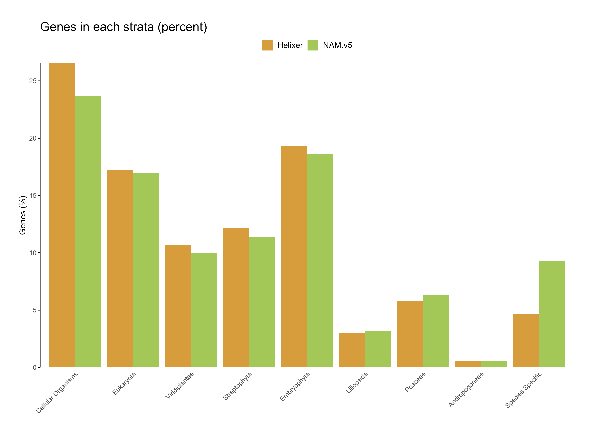

# Gene prediction using Helixer

Helixer is a deep learning-based gene prediction tool that uses a convolutional neural network (CNN) to predict genes in eukaryotic genomes. Helixer is trained on a wide range of eukaryotic genomes and can predict genes in both plant and animal genomes. Helixer can predict genes wihtout any extrinisic information such as RNA-seq data or homology information, purely based on the sequence of the genome.

## 1. Installation

Helixer is available as a Singularity container. You can pull the container using the following command:

```bash
singularity pull docker://gglyptodon/helixer-docker:helixer_v0.3.3_cuda_11.8.0-cudnn8
```

This will create `helixer_v0.3.3_cuda_11.8.0-cudnn8.sif` file in the current directory. We will rename this file to `helixer.sif` for simplicity.


## 2. Downloading trained models


Helixer requires a trained model to predict genes. With the included script `fetch_helixer_models.py` you can download models for specific lineages. Currently, models are available for the following lineages:

- `land_plant`
- `vertebrate`
- `invertibrate`
- `fungi`

There are instructions to [train your own models](https://github.com/weberlab-hhu/Helixer/blob/main/docs/training.md) as well as [fine tune](https://github.com/weberlab-hhu/Helixer/blob/main/docs/fine_tuning.md) the existing models using the RNAseq data for the species of interest. But for this tutorial, we will just use the pre-trained models.


```bash
singularity exec helixer.sif fetch_helixer_models.py --all
```

This will download all lineage models in the `models` directory. You can also download models for specific lineages using the `--lineage` option.

The files downloaded will be in the following structure:

```
└── models
    ├── fungi
    │   └── fungi_v0.3_a_0100.h5
    ├── invertebrate
    │   └── invertebrate_v0.3_m_0100.h5
    ├── land_plant
    │   └── land_plant_v0.3_a_0080.h5
    ├── model_list.csv
    └── vertebrate
        └── vertebrate_v0.3_m_0080.h5
```


## 3. Running Helixer

Helixer requires GPU for prediction. For running Helixer, you need to request a GPU node. You will also need the genome sequence in fasta format. For this tutorial, we will use Maize genome (_Zea mays_ subsp. _mays_), and use the `land_plant` model to predict genes.


**Donwload the genome sequence:**

```bash
wget https://download.maizegdb.org/Zm-B73-REFERENCE-NAM-5.0/Zm-B73-REFERENCE-NAM-5.0.fa.gz
gunzip Zm-B73-REFERENCE-NAM-5.0.fa.gz
```

**Run Helixer:**

```bash
genome=Zm-B73-REFERENCE-NAM-5.0.fa
species="Zea mays subsp. mays"
output=B73-helixer.gff
singularity exec \
    --bind ${RCAC_SCRATCH} \
    --nv helixer.sif Helixer.py \
    --lineage land_plant \
    --fasta-path ${genome} \
    --species ${species} \
    --gff-output-path ${output}
```

```{note}
In `A100` GPU nodes, the run time for predicting genes in Maize genome takes around 3.5 hours (03:36:23), with 6 CPUs `--ntasks-per-node=6`. The memory usage was 7.98 GB. 
```

The GFF format output had 41,923 genes predicted using Helixer. You can view the various features in the `gff` file using the following command:

```bash
grep -v "^#" B73-helixer.gff | cut -f 3 | sort | uniq -c
```

outputs:

```
2,19,488  CDS
2,41,560  exon
  52,607  five_prime_UTR
  41,923  gene
  41,923  mRNA
  52,298  three_prime_UTR
```

```{warning}
As you may have noticed, the number of `mRNA` and `gene` features are the same. This is because isoforms aren't predicted by Helixer and you only have one transcript per gene. Exons are indetified with high confidence and alternative isoforms are usually collapsed into a single gene model.  
```


## 4. Comparing and benchmarking

We will download the reference annotations for Maize genome from [MaizeGDB](https://www.maizegdb.org/) and compare the predicted genes with the reference annotations.

```bash
wget https://download.maizegdb.org/Zm-B73-REFERENCE-NAM-5.0/Zm-B73-REFERENCE-NAM-5.0.gff3.gz
gunzip Zm-B73-REFERENCE-NAM-5.0.gff3.gz
```

**Processing GFF output**

The output generated by Helixer is in GFF format. However we might have to format it further to make it compatible with our processing workflow. Here are the steps to process the GFF output:

```bash
# sanitize the gff3 file
ml purge
ml biocontainers
ml genometools
gff3_file=B73-helixer.gff
gt gff3 \
    -sort \
    -tidy \
    -setsource "helixer" \
    -force -o B73-helixer_gt.gff3 \
    ${gff3_file}

# standardize
ml purge
ml biocontainers
ml agat
agat_convert_sp_gxf2gxf.pl \
    -g B73-helixer_gt.gff3 \
    -o B73-helixer_v1.0.gff3

# extract CDS and PEP sequneces
ml purge
ml biocontainers
ml cufflinks
gffread B73-helixer_v1.0.gff3 \
    -g Zm-B73-REFERENCE-NAM-5.0.fa \
    -x B73-helixer_v1.0.cds.fasta \
    -y B73-helixer_v1.0.pep.fasta
```


### A. BUSCO profiling

We will use [`BUSCO`](https://busco.ezlab.org/) to profile the predicted genes and reference annotations.

```bash
ml biocontainers
ml busco
busco \
    -i B73-helixer_v1.0.pep.fasta \
    -c ${SLURM_CPUS_ON_NODE} \
    -o B73-helixer_v1.0_busco \
    -m prot \
    -l poales_odb10 \
    -f 
```

We will also do this on the original reference annotations as well as the genome sequence.

**Reference genome:**

```bash
# reference genome
busco \
    -i Zm-B73-REFERENCE-NAM-5.0.fa \
    -c ${SLURM_CPUS_ON_NODE} \
    -o Zm-B73-REFERENCE-NAM-5.0_busco \
    -m genome \
    -l poales_odb10 \
    -f
```

**Reference annotations:**

```bash
# reference annotations
wget https://download.maizegdb.org/Zm-B73-REFERENCE-NAM-5.0/Zm-B73-REFERENCE-NAM-5.0_Zm00001eb.1.protein.fa.gz
gunzip Zm-B73-REFERENCE-NAM-5.0_Zm00001eb.1.protein.fa.gz
busco \
    -i Zm-B73-REFERENCE-NAM-5.0_Zm00001eb.1.protein.fa \
    -c ${SLURM_CPUS_ON_NODE} \
    -o Zm-B73-REFERENCE-NAM-5.0_protein_busco \
    -m prot \
    -l poales_odb10 \
    -f
```

Once the BUSCO profiling is done, the results can be compared. 

**Table 1: BUSCO results**


| Category                    | Helixer            | B73.v5 (MaizeGDB)  | B73.v5 (Reference) |
|-----------------------------|:------------------|--------------------|--------------------|
| Complete BUSCOs             | 4,808 (98.2%)     | 4,729 (96.6%)      | 4,807 (98.2%)      |
| Single-Copy BUSCOs          | 4,053 (82.8%)     | 2,123 (43.4%)      | 4,053 (82.8%)      |
| Duplicated BUSCOs           | 755 (15.4%)       | 2606 (53.2%)       | 754 (15.4%)        |
| Fragmented BUSCOs           | 34 (0.7%)         | 39 (0.8%)          | 10 (0.2%)          |
| Missing BUSCOs              | 54 (1.1%)         | 128 (2.6%)         | 79 (1.6%)          |
| Total BUSCOs                | 4,896             | 4,896              | 4,896              |

or visualized as a stacked bar plot:




**Figure 1: BUSCO results for Helixer, B73.v5 (MaizeGDB) and B73.v5 (Reference) annotations.**

```{note}
The Helixer predictions shows higher number of complete BUSCOs (single-copy + duplicated) than current B73.v5 annotations available at MaizeGDB. It also reports only 54 missing BUSCOs, lowest among all 3 BUSCO results meaning it was able to recover more BUSCO genes than what BUSCO software could predict/recover using AUGUSTUS/tblastn search!
```


```{warning}
The duplicated genes in B73.v5 (MaizeGDB) should not be interpreted as paralogs. Since we did not use just primary transcripts for running BUSCO, the alternative isoforms of the same gene are reported as "duplicated". 
```

### B. Comparing annotations

We will use [`mikado`](https://mikado.readthedocs.io/en/stable/) to compare the annotations. Mikado is a tool to compare and merge gene annotations. We will use the [`mikado compare`](https://mikado.readthedocs.io/en/stable/Usage/Compare/) command to compare the annotations. We will filter V5 annotations to only include primary transcripts and only compare protein coding genes.

```bash
conda activate mikado
mikado compare \
    --protein-coding \
    -r B73.v5_primary-only.gff3 \
    -p B73-helixer_v1.0.gff3 \
    -o ref_NAM.B73v5-vs-prediction_HELIXERv1_compared \
    --log compare.log
```

The output will be in the `ref_NAM.B73v5-vs-prediction_HELIXERv1_compared` directory. The `summary.tsv` file will have the comparison results.

**Table 2: Mikado comparison results**

| Comparison Level              | Sensitivity (Sn) | Precision (Pr) | F1 Score |
|-------------------------------|------------------|----------------|----------|
| Base level                    | 81.90%           | 75.29%         | 78.46%   |
| Exon level (stringent)         | 53.21%           | 42.82%         | 47.46%   |
| Exon level (lenient)           | 75.93%           | 61.02%         | 67.66%   |
| Splice site level              | 85.06%           | 65.89%         | 74.26%   |
| Intron level                   | 78.45%           | 60.77%         | 68.49%   |
| Intron chain level (stringent) | 38.10%           | 32.85%         | 35.28%   |
| Transcript level (>=80% base F1)| 36.89%          | 34.98%         | 35.91%   |
| Gene level (>=80% base F1)     | 36.89%           | 34.98%         | 35.91%   |

```{note}
When compared against each other, the Helixer predictions, at base level, matches the B73.v5 (maizeGDB annotations) really well. However, the precision is lower for Helixer predictions, likely because there are higher number of novel genes predicted in Helixer that are non existant in B73.v5 annotations. 
```

**Table 3: Summary of comparison**

| Feature          | Total Count | Missed Count (%)  | Novel Count (%)  |
|------------------|-------------|-------------------|------------------|
| Transcripts      | 39,756      | 7,539 (18.96%)    | 8,306 (19.81%)   |
| Genes            | 39,756      | 7,539 (18.96%)    | 8,306 (19.81%)   |


```{note}
The Helixer predictions missed 7,359 predictions (out of 39,756) that were in B73.v5, but also predicted 8,306 novel transcripts. Since Helixer does not predict isoforms, the number of genes and transcripts are the same.  
```

### C. Feature assignment

B73 has extensive expression data and this can be used to evaluate the gene predictions. If the annotations are accurate, more RNA-seq reads will align within the predicted features, making a higher proportion of assigned reads an indicator of annotation accuracy. Similarly, higher proportions of unassigned reads indicate potential inaccuracies in the annotations, suggesting that important features may be missing or incorrectly predicted.

Expression data for B73 was downloaded from MaizeGDB (as BAM files) and feature assignment was done using [`featureCounts`](https://subread.sourceforge.net/featureCounts.html) from the [`subread`](https://subread.sourceforge.net/) package (both NAM.v5 and Helixer predictions). 


```bash
ml biocontainers
ml subread
featureCounts \
    -T 8 \
    -a Zm-B73-REFERENCE-NAM-5.0_Zm00001eb.1.gff3 \
    -o v5.str2 \
    -s 2 \
    -p --countReadPairs \
    -t gene -g ID \
    --tmpDir /dev/shm \
    *.bam &> v5_gene-str2_PE.stdout

featureCounts \
    -T 8 \
    -a B73-helixer_v1.0.gff3 \
    -o helixer.str2 \
    -s 2 \
    -p --countReadPairs \
    -t gene -g ID \
    --tmpDir /dev/shm \
    *.bam &> helixer_gene-str2_PE.stdout
```

::::{tab-set}

:::{tab-item} Assigned Features



**Figure 2: Feature assignment for B73.v5 and Helixer predictions. The reads assigned to helixer features are higher across tissues as compared to NAM.v5 annotations.**

:::

:::{tab-item} Unassigned Features




**Figure 3: Feature assignment for B73.v5 and Helixer predictions. The unassigned reads are higher for NAM.v5 annotations across tissues.**

:::

::::

The code used for parsing `featureCounts` summary files and generating the plots can be found here: [`parse_subreads.R`](assets/scripts/parse_subreads.R)

```{note}
The slightly higher assignment rate for Helixer predictions suggests that the predictions are capturing more coding regions of the genome. Similarly, lower unassigned reads indicate Helixer predictions have better accuracy than current annotations. For differential gene expression studies, higher assignment rates are desirable as they indicate more accurate gene models.
```


### D. Functional annotation

The Eukaryotic Non-Model Transcriptome Annotation Pipeline (EnTAP) can be used for functional annotation of the predicted genes. We will use the `entap` pipeline determine proportion of genes with functional annotations in each predictions.

```bash
ml purge
ml anaconda
conda activate entap
for cds in B73-helixer_v1.0.cds.fasta Zm-B73-REFERENCE-NAM-5.0_Zm00001eb.1.cds.fa; do
EnTAP \
    --runP \
    -i ${cds} \
    -d ${RCAC_SCRATCH}/entap_db/bin/ncbi_refseq_plants.dmnd \
    -d ${RCAC_SCRATCH}/entap_db/bin/uniprot_sprot.dmnd  \
    -t ${SLURM_CPUS_ON_NODE} \
    --ini ${RCAC_SCRATCH}/entap_db/entap_config.ini
done
```


::::{tab-set}

:::{tab-item} Percent identity



**Figure 4: Percent identity of each predicted gene to the reference databases sequences (one hit per query).**

:::

:::{tab-item} Coding frame with gene function  


**Figure 5: Distribution of frame completeness with presence of gene function across predictions**

:::

:::{tab-item} Coding frame with pfam domain  




**Figure 5: Distribution of frame completeness with presence of pfam domains across predictions**
:::


::::

The code used for parsing EnTAP's `entap_results.tsv` files and generating the plots can be found here: [`parse_subreads.R`](assets/scripts/entap_results_plot.R)

```{note}
The functional annotation results show that the Helixer predictions have higher proportion of genes with functional annotations compared to the reference annotations. Predictions with similairty to existing sequences in the databases are likely to be more accurate than those without any similarity.
```
### E. Phylostrata analysis

Phylostrata analysis can be used to determine the evolutionary age of the predicted genes. We will use the `phylostrata` package to determine the phylostrata of the predicted genes.

::::{tab-set}

:::{tab-item} counts 



**Figure 6: Genes in each starta for the predictions (count)**

:::

:::{tab-item} percent  




**Figure 7: Genes in each starta for the predictions (percent)**

:::

::::

The code used for parsing phylostrata analyses ([`phylostrata_run.R`](assets/scripts/phylostrata_run.R)) and for plotting results ([`phylostrata_plot.R`](assets/scripts/phylostrata_plot.R)) are provided in the repository.

```{note}
The higher proportion of genes in deeply conserved phylostrata (e.g., cellular organisms and eukaryota) underscores Helixer's strength in accurately identifying core, evolutionarily conserved genes. This alignment with conserved regions can be interpreted as strong evidence of the model’s reliability in identifying well-established gene structures.
```

```{warning}
Limitations in Novel Gene Identification: The relatively low representation in species-specific phylostrata suggests that Helixer may struggle with genes that are unique or novel to a particular species. This could be due to the lack of specific training data for these novel genes or the limitations of the model in detecting sequences that deviate from conserved gene structures.
```

### F. GFF3 stats comparison


### G. OMArk proteome assesment


### H. CDS assesments (GC, length, start/stop)


## Key Points


1. **Helixer’s strength in conserved genes**: Helixer effectively predicts genes in deeply conserved phylostrata, indicating strong performance in identifying core, evolutionarily stable genes across eukaryotic lineages.

2. **Limited novel gene detection**: Helixer shows lower accuracy in detecting species-specific genes, suggesting that identifying novel or rapidly evolving genes may not be its primary strength.

3. **Pre-trained models for versatile Use**: With pre-trained models for various lineages (plants, animals, fungi), Helixer is accessible for multiple research applications without requiring additional RNA-seq or homology data.

4. **Simplicity of Gene Prediction**: Helixer allows for rapid and straightforward gene prediction with a single command, requiring no external data or repeat masking. It can predict genes in complex, highly repetitive genomes like maize in under four hours. This simplicity, combined with easy installation, has the potential to revolutionize gene prediction workflows. 

5. **Ideal for Comparative Genomics**: Helixer’s robust detection of conserved genes makes it a valuable tool for studies focused on comparative genomics and understanding fundamental gene functions.

6. **Potential for Improvement**: The presence of unassigned reads across samples and limited species-specific gene detection highlight areas for future model refinement, possibly with custom training for novel species. 

```{warning}
Helixer requires GPU for prediction to run efficiently. The prediction time can vary based on the size of the genome and the complexity of the gene structures. 
```


## 5. References

- [Helixer GitHub](https://github.com/weberlab-hhu/Helixer)
- [Helixer Webtool](https://www.plabipd.de/helixer_main.html/)

- Holst F, Bolger A, Günther C, Maß J, Kindel F, Triesch S, Kiel N, Saadat N, Ebenhöh O, Usadel B,Schwacke R, Bolger M, Weber APM, Denton AK
Helixer - de novo prediction of primary eukaryotic gene models combining deep learning and aHidden Markov model.
bioRxiv. 2023 Feb 06: 2023.02.06.527280.  Preprint. (not been certified by peer review)

- Stiehler F, Steinborn M, Scholz S, Dey D, Weber APM, Denton AK
Helixer: cross-species gene annotation of large eukaryotic genomes using deep learning.
Bioinformatics. 2020 Dec, 36(22-23): 5291-5298.
