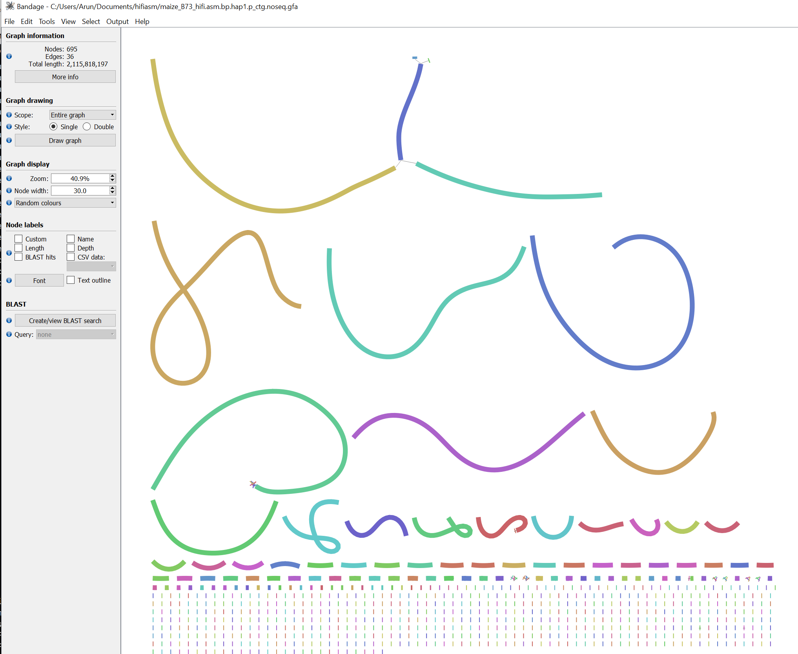
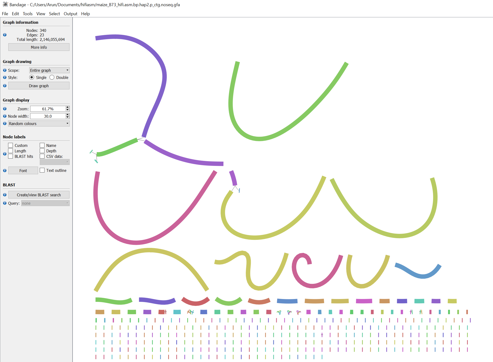

# Genome assembly using HiFi reads

A short guide to assemble genomes from long reads (PacBio HiFi) using [HiFiasm](https://github.com/chhylp123/hifiasm)


## 1.	Installation

Manually installing `hifiasm` is easy. The instructions as listed in the [GitHub repository](https://github.com/chhylp123/hifiasm) are as follows:

```bash
git clone https://github.com/chhylp123/hifiasm
cd hifiasm && make
```

But in case if you have any problems, you can use the Singularity container. First, download the [recipe file from the GitHub gist](https://gist.github.com/aseetharam/6755b9eb93644d5d95485209447dbc71). Rename the file to `hifiasm_v0.20.0-r639.def` and build the container

```bash
singularity build hifiasm.sif hifiasm_v0.20.0-r639.def
```

This will create `hifiasm.sif` file in the current directory. 


## 2.	Download HiFi reads

To run HiFiasm, we need HiFi reads. We will download sample datasets from [PacBio website](https://www.pacb.com/connect/datasets/). For this specific tutorial, we will use the [PacBio HiFi data for maize B73 genome](https://downloads.pacbcloud.com/public/revio/2023Q1/maize-B73-rep1/). 

```bash
wget https://downloads.pacbcloud.com/public/revio/2023Q1/maize-B73-rep1/m84006_221229_002525_s1.hifi_reads.bam
```

First step is to convert the HiFi reads in bam format to fasta (or fastq) format. We can use `samtools` for this. 

```{warning}
Be sure to run the computationally intensive steps on a compute node, not the login node. You can request an interactive session using `salloc` command. 
```


```bash
ml biocontainers
ml samtools
samtools fasta \
    -threads ${SLURM_CPUS_ON_NODE} \
    m84006_221229_002525_s1.hifi_reads.bam > maize-hifi.fasta
```

Before proceeding, lets quickly check our input file (read depth and other stats). 

```bash
ml biocontainers
ml seqkit
seqkit stats  \
    --all \
    --threads ${SLURM_CPUS_ON_NODE} \
    --out-file summary-stats.out \
    maize-hifi.fasta
```

This will generate a file `summary-stats.out` with the statistics of the input file. 

**Table 1: Summary statistics of the input file `maize-hifi.fasta`**

| **Property**  | **Value**         |
|---------------|-------------------|
| file          | maize-hifi.fasta  |
| format        | FASTA             |
| type          | DNA               |
| num_seqs      | 5,142,754         |
| sum_len       | 70,099,174,236    |
| min_len       | 94                |
| avg_len       | 13,630.70         |
| max_len       | 55,776            |
| Q1            | 10,374            |
| Q2            | 13,501            |
| Q3            | 16,921            |
| sum_gap       | 0                 |
| N50           | 15,265            |
| Q20(%)        | 0                 |
| Q30(%)        | 0                 |
| GC(%)         | 45.62             |


So assuming 2,400Mb genome size for maize, our sequencing depth will be 70,099,174,236 bp / 2,400,000,000  = 29.2x.
Ohter stats reported are the number of sequences, minimum, maximum, and average length of the sequences, N50, and GC content. They all reaffirm the quality of the input file.


```{note}
Running `fastqc` on the PacBio HiFi reads does not provide the required information as the reads are too long and the encoded quality scores are not the same as in short reads.  
```

## 3.	Run HiFiasm

Now we can run HiFiasm on the fasta file. Be sure to check the [documentation](https://hifiasm.readthedocs.io/en/latest/parameter-reference.html#parameter-reference) for all the options available.

First, we will run `hifiasm` with default suggested parameters.


```bash
singularity exec hifiasm.sif hifiasm \
    -t ${SLURM_CPUS_ON_NODE} \
    -o maize_B73_hifi.asm \
    maize-hifi.fasta
```

This will generate partially phased contigs with filenames `maize_B73_hifi.asm.bp.hap[12].p_ctg.gfa`. This pair of files can be thought to represent the two haplotypes in a diploid genome, though with occasional switch errors. The frequency of switches is determined by the heterozygosity of the input sample. Since B73 is an inbred, we can expect most of the genome to be identical to each other in these files.

The other files of importance are `.bp.p_ctg.gfa`, `.bp.p_utg.gfa` and `.bp.r_utg.gfa` (the counterparts of these files have an extension `.noseq.gfa` instead of `.gfa`, that contains no sequence and can be used for visualization using programs such as [`bandage`](https://rrwick.github.io/Bandage/)). These files represent the primary contigs, primary unitigs, and redundant unitigs, respectively. The files are usually not necessary and can be ignored for most purposes. 


First, let's check the statistics of the output files. For this, we will need to convert the `.gfa` files to `.fasta` format. 

```bash
for f in *.hap[12].p_ctg.gfa; do
    awk '/^S/{print ">"$2"\n"$3}' ${f} > ${f%.gfa}.fasta
done
```

Now we can check the statistics of the output files. 

```bash
ml biocontainers
ml quast
quast.py \
    --fast \
    --threads ${SLURM_CPUS_ON_NODE} \
    -o maize_B73_hifi.asm.stats \
    *.hap[12].p_ctg.fasta
```

This will generate a folder `maize_B73_hifi.asm.stats` with the statistics of the output files.

**Table 2: Summary statistics of the assembled contigs**

| **Assembly**                  | **maize_B73_hifi.asm.bp.hap1.p_ctg** | **maize_B73_hifi.asm.bp.hap2.p_ctg** |
|-------------------------------|--------------------------------------|--------------------------------------|
| # contigs (>= 0 bp)            | 695                                  | 340                                  |
| # contigs (>= 1000 bp)         | 695                                  | 340                                  |
| # contigs (>= 5000 bp)         | 695                                  | 340                                  |
| # contigs (>= 10000 bp)        | 695                                  | 340                                  |
| # contigs (>= 25000 bp)        | 648                                  | 336                                  |
| # contigs (>= 50000 bp)        | 311                                  | 245                                  |
| Total length (>= 0 bp)         | 2,115,818,197                        | 2,146,055,694                        |
| Total length (>= 1000 bp)      | 2,115,818,197                        | 2,146,055,694                        |
| Total length (>= 5000 bp)      | 2,115,818,197                        | 2,146,055,694                        |
| Total length (>= 10000 bp)     | 2,115,818,197                        | 2,146,055,694                        |
| Total length (>= 25000 bp)     | 2,114,814,205                        | 2,145,970,005                        |
| Total length (>= 50000 bp)     | 2,102,601,706                        | 2,142,223,242                        |
| # contigs                     | 695                                  | 340                                  |
| Largest contig                | 230,900,369                          | 229,694,453                          |
| Total length                  | 2,115,818,197                        | 2,146,055,694                        |
| N50                           | 92,331,732                           | 156,748,501                          |
| N90                           | 8,066,869                            | 10,922,511                           |
| auN                           | 110,840,927.5                        | 131,176,388.9                        |
| L50                           | 7                                    | 6                                    |
| L90                           | 39                                   | 23                                   |
| # N's per 100 kbp             | 0.00                                 | 0.00                                 |


The statistics show that the assembly is of high quality with N50 of 92MB and 156MB for hap1 and hap2, respectively. The largest contig is 230MB and 229MB for hap1 and hap2, respectively, suggest that we probably have an entire chromosome in a single contig. The entire genome (2.1GB) is represented in 695 and 340 contigs for hap1 and hap2!

```{note}
The `hifiasm` job was run on `negishi` cluster with 64 CPUs and 128Gb memory. The job took about ~3 hours to complete  (02:54:44). The reported memory usage was 68.47GB. 
```

```{note} 

## 4.	Visualizing the assembly

To better understand how well the assembly is constructed, we can use the `noseq.gfa` files generated by `hifiasm` to visualize the assembly graph. We can use `bandage` for this purpose. These files are small and `bandage` can be run from your local machine. Get the required files and install `bandage` on your local machine. 

```{note}
this command should be run on your local machine. The source files should be adjusted accordingly.
```

```bash
rsync -avP negishi:/scratch/negishi/$USER/hifasm/maize_B73_hifi.asm.bp.hap[12].p_ctg.noseq.gfa ./
```

Now you can run `bandage` and open the `*noseq.gfa` files. 




Figure 1: Bandage visualization of the assembly graph (hap1). While most contigs are constructed from a single unitig, there are a few contigs that maybe joined from multiple unitigs. The largest contig appears to be made of multiple unitigs and terminal region may not be fully resolved.

There are likely other contigs that may not be fully resolved but since we plan to use Optical Genome Mapping (OGM) data to scaffold the assembly, we can proceed with the current assembly. The OGM data will help resolve these regions and provide a more contiguous assembly.




Figure 2: Bandage visualization of the assembly graph (hap2). Similar to hap1, most contigs are constructed from a single unitig, and largest contig may not be fully resolved. 

```{warning}
If you are ending your analysis here, you may want to further break these regions into smaller contigs for better resolution. 
```

## 5.	Conclusion

In this tutorial, we have assembled the maize B73 genome using PacBio HiFi reads. The assembled contigs are of high quality and can be further scaffolded using Optical Genome Mapping data or Hi-C data. These contigs are purely based on the HiFi reads there could be unresolved or incorrect contigs. Using homology approches, we can further validate the assembly and fix those regions.  


## FAQs

### 1. What other options are available in `hifiasm` that affect the assembly?

There are several options available in `hifiasm` that can affect the assembly. The important assembly options are listed in the manual page [here](https://hifiasm.readthedocs.io/en/latest/parameter-reference.html#assembly-options). 

### 2. Why did I get two haplotypes in the output?

The two haplotypes generated by `hifiasm` are controlled by level of purge duplication option `-l`. The default value is 3, which means it will purge all types of haplotigs in the most aggressive way. You can disable it using `-l 0` option or you can only purge heterozygous overlaps using `-l 1`.

### 3. I have too many small contigs, how can I reduce them?

You can use the `-n` option to remove unitigs with coverage less than the specified value. The default value is 3 and increasing it will remove unitigs with poor coverage and reduce the number of contigs.

### 4. My assembly as shown in Bandage has a lot of bubbles/loops, how can I resolve them?

The bubbles/loops in the assembly graph can be resolved during the scaffolding step, using either Hi-C data or Optical Genome Mapping data. But you can also try `-u` to disable post-join step for contigs. This may result in more contigs and poor N50 but may help resolve the bubbles/loops.