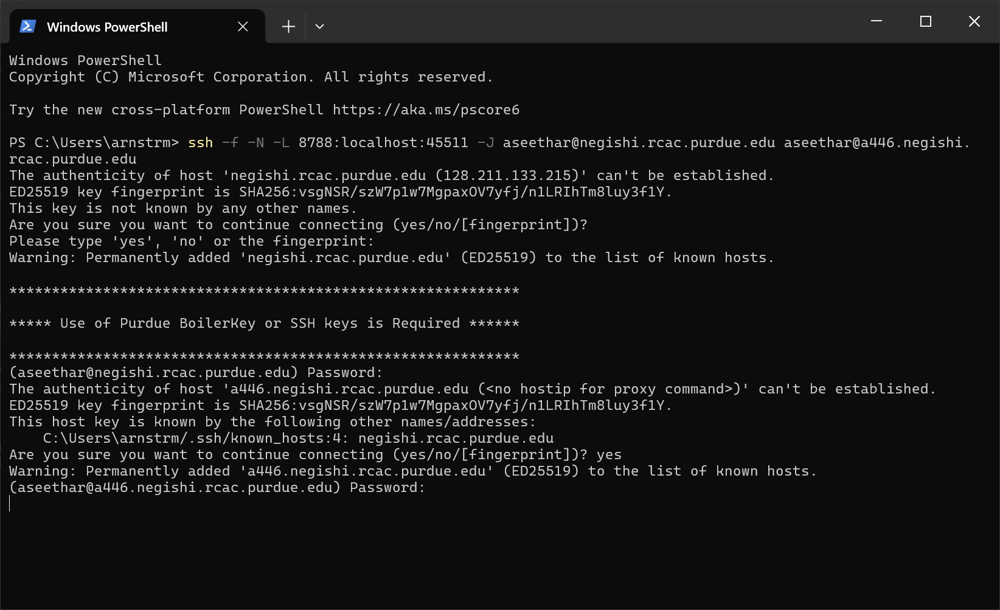
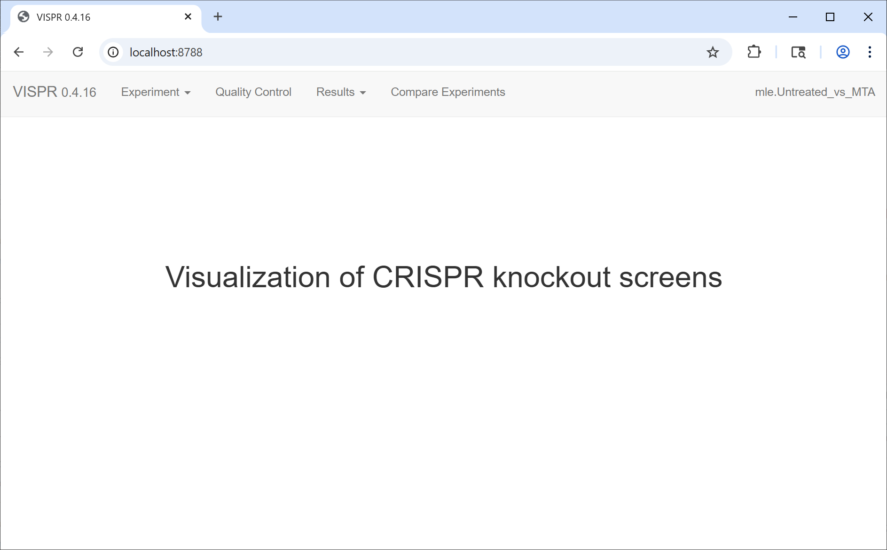

# MAGeCK-VISPR visualization guide

MAGeCK-VISPR is a comprehensive quality control, analysis, and visualization workflow for CRISPR/Cas9 screens. This guide provides a straightforward method for running the visualization component on an HPC cluster and viewing the results on your local machine.

## 1. Connect to HPC and start an interactive session

First, open a terminal on your local computer and connect to the HPC cluster. Then, request an interactive session on a compute node.

```bash
# Connect to a Purdue RCAC HPC cluster (e.g., Negishi)
ssh your_username@negishi.rcac.purdue.edu

# Request an interactive node with 8 cores for 4 hours
# Replace "your_account" with your specific account/allocation name
salloc -N 1 -n 8 -t 4:00:00 -A your_account
```

Once the job is allocated, you'll be automatically connected to a compute node. Take note of the node's name (e.g., `a446`) as you will need it later.

You can also do `echo $SLURM_JOB_NODELIST` to see the node name.


## 2. Load the modules and start the VISPR server

Next, load the required software modules and navigate to the directory containing your MAGeCK-VISPR results.

```bash
# Load the necessary modules
ml biocontainers
ml mageck-vispr

# Navigate to your project directory
cd /path/to/your/mageck-output

# Find a port number that is not in use
python3 -c 'import socket; s=socket.socket(); s.bind(("", 0)); print(s.getsockname()[1]); s.close()'
```

This command will output a port number that is not currently in use. You can use this port number to run the VISPR server. In my case, it returned `45511`, but yours may be different.


```bash
# Start the VISPR server using the Apptainer container
# Replace port number (45511) with the port number you found in the previous step
apptainer exec /apps/biocontainers/images/quay.io_biocontainers_mageck-vispr\:0.5.6--py_0.sif \
vispr server --port 45511 results/*.vispr.yaml
```

The server will start and indicate it's running on a specific port, `45511`. **Leave this terminal running.**


```{warning}
The session should remain active and should not display any errors. Warning messages are normal, but if you see errors, please check the module versions or your input files.
```


:::{dropdown} Click here to see an example output

Above command will output something like this:

```{code-block} bash
:caption: Negishi HPC terminal output
$ apptainer exec /apps/biocontainers/images/quay.io_biocontainers_mageck-vispr\:0.5.6--py_0.sif \
vispr server --port 45511 results/*.yaml
Loading data.
  config = yaml.load(f)
Starting server.

Open:  go to 127.0.0.1:45511 in your browser.
Note: Safari and Internet Explorer are currently unsupported.
Close: hit Ctrl-C in this terminal.
 * Serving Flask app "vispr.server" (lazy loading)
 * Environment: production
   WARNING: This is a development server. Do not use it in a production deployment.
   Use a production WSGI server instead.
 * Debug mode: off

```
:::


## 3. Forward the port to your local computer

To view the web interface, you need to create an SSH tunnel from the compute node to your local machine.

Open a **new, second terminal** on your local computer and run the following command.

```{warning}
This command must be run from your local machine, not the HPC node. For Windows users, you can use PowerShell or a WSL terminal that supports SSH. For Mac and Linux users, the terminal should work as is.
```

```bash
# Replace <node_name> with the name of the node from step 1 (e.g., a446.negishi.rcac.purdue.edu)
# Replace <port> with the port number from the server output (e.g., 45511)
# Replace <your_username> and <hpc_login_node> with your details
ssh -L <port>:localhost:<port> -J <your_username>@<hpc_login_node> <your_username>@<node_name>
```

**Example:**

If your job is on node `a446`, the server is on port `45511`, your username is `pete`, and you log into `negishi.rcac.purdue.edu`, the command would be:

```bash
ssh -f -N -L 8788:localhost:45511 -J pete@negishi.rcac.purdue.edu pete@a446.negishi.rcac.purdue.edu
```

```{note}
You will be asked to enter your password for the HPC login node (or use the `ssh-key` if you have set it up and login without any prompt). Since you will likely be connecting to the compute node for the very first time you will also be asked to confirm the authenticity of the host. Type "yes" to continue.
```




Figure 1: SSH tunnel command output (local PowerShell terminal is being used here)

### SSH tunnel command breakdown

The following table explains the components of the SSH command used to tunnel port 45511 through a jump host:

| Option | Description |
|--------|-------------|
| `-f` | Forks the SSH process to the background after the connection is established. Useful for tunnels. |
| `-N` | Does not execute any remote command; used when forwarding ports only. |
| `-L 8788:localhost:45511` | Forwards local port 8788 to port 45511 on the remote machine (`a446`) through the tunnel. Format: `local_port:remote_host:remote_port`. |
| `-J pete@negishi.rcac.purdue.edu` | Uses `negishi` as a **jump host** to reach the target server (`a446`). |
| `pete@a446.negishi.rcac.purdue.edu` | The final destination host where the port-forwarded service is running. |


## 4. View the VISPR interface
After successfully establishing the SSH tunnel, you can now access the VISPR web interface from your local machine.

Open a web browser and navigate to:

```
http://localhost:8788
```

(Replace `8788` with the local port number you used for forwarding). You should now see the interactive VISPR interface.

